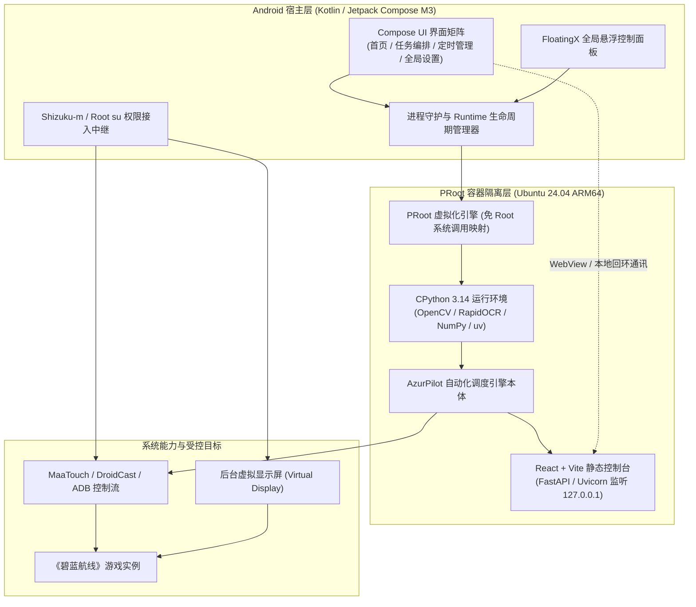

<div align="center">


# AzurPilot for Android

**无需电脑与常驻服务器 · 原生轻量化运行 · 后台虚拟屏无感挂机**

全功能《碧蓝航线》自动化助手 [AzurPilot](https://github.com/wess09/AzurPilot) 专用的 Android 移动端一体化运行环境

<p align="center">
  <b>简体中文</b> |
  <a href="README_en.md">English</a> |
  <a href="README_ja.md">日本語</a> |
  <a href="README_zh-TW.md">繁體中文</a>
</p>

---

<!-- 核心环境与平台标签组 -->
<p align="center">
  <a href="./LICENSE"></a>
  <a href="https://developer.android.com/about/versions/pie"></a>
  <a href="https://en.wikipedia.org/wiki/AArch64"></a>
  <a href="https://ubuntu.com/"></a>
  <a href="https://www.python.org/"></a>
  <a href="https://github.com/astral-sh/uv"></a>
</p>

<!-- 技术栈与框架标签组 -->
<p align="center">
  <a href="https://kotlinlang.org/"></a>
  <a href="https://react.dev/"></a>
  <a href="https://shizuku.rikka.app/"></a>
  <a href="https://opencv.org/"></a>
  <a href="https://proot-me.github.io/"></a>
  <a href="https://deepwiki.com/wess09/AzurPilot-for-Android"></a>
</p>

<!-- 仓库动态与社区指标标签组 -->
<p align="center">
  <a href="https://github.com/wess09/AzurPilot-for-Android/releases/latest"></a>
  <a href="https://github.com/wess09/AzurPilot-for-Android/releases"></a>
  <a href="https://github.com/wess09/AzurPilot-for-Android/stargazers"></a>
  <a href="https://github.com/wess09/AzurPilot-for-Android/network/members"></a>
  <a href="https://github.com/wess09/AzurPilot-for-Android/issues"></a>
  <a href="https://github.com/wess09/AzurPilot-for-Android/commits/main"></a>
</p>

<p align="center">
  <a href="#工程总览与指标">工程总览</a> •
  <a href="#代码知识库与-ai-问答">智能问答</a> •
  <a href="#项目概述">项目概述</a> •
  <a href="#关联生态工程">关联生态</a> •
  <a href="#核心特性">核心特性</a> •
  <a href="#系统架构全景">系统架构</a> •
  <a href="#环境规格与兼容性">环境规格</a> •
  <a href="#快速开始">快速开始</a> •
  <a href="#功能界面一览">功能界面</a> •
  <a href="#双轨独立更新机制">双轨更新</a> •
  <a href="#研发活跃度">研发活跃</a> •
  <a href="#star-增长趋势">增长趋势</a> •
  <a href="#社区生态与支持">社区支持</a>
</p>

</div>

---

## 工程总览与指标

<table width="100%">
  <thead>
    <tr>
      <th colspan="4" align="left">
        
        <b>工程核心运行与研发指标</b>
      </th>
    </tr>
  </thead>
  <tbody>
    <tr>
      <td width="25%"><b>最新正式版</b><br><a href="https://github.com/wess09/AzurPilot-for-Android/releases/latest"></a></td>
      <td width="25%"><b>累计下载量</b><br><a href="https://github.com/wess09/AzurPilot-for-Android/releases"></a></td>
      <td width="25%"><b>开源许可证</b><br><a href="./LICENSE"></a></td>
      <td width="25%"><b>主分支状态</b><br><a href="https://github.com/wess09/AzurPilot-for-Android/actions"></a></td>
    </tr>
    <tr>
      <td width="25%"><b>代码库体积</b><br></td>
      <td width="25%"><b>代码语言</b><br></td>
      <td width="25%"><b>提权执行方式</b><br></td>
      <td width="25%"><b>目标系统</b><br></td>
    </tr>
    <tr>
      <td colspan="4">
        <b>快速操作快捷入口：</b>
        <a href="https://github.com/wess09/AzurPilot-for-Android/releases/latest"></a>
        <a href="https://deepwiki.com/wess09/AzurPilot-for-Android"></a>
        <a href="https://github.com/wess09/AzurPilot-for-Android/issues/new/choose"></a>
        <a href="https://github.com/wess09/AzurPilot-for-Android/pulls"></a>
        <a href="https://github.com/wess09/AzurPilot-for-Android/stargazers"></a>
      </td>
    </tr>
  </tbody>
</table>

---

## 代码知识库与 AI 问答

<table width="100%">
  <tr>
    <td width="70%" valign="middle">
      <br>
      <h3>Ask DeepWiki 代码库智能问答</h3>
      <p>对项目的内部模块、PRoot 沙盒机制、虚拟屏渲染逻辑或定时任务调度规则有任何疑问？直接向已索引本仓库全量上下文的 DeepWiki 发起提问，快速获取针对性的架构解析与代码导引。</p>
      <div>
        <a href="https://deepwiki.com/wess09/AzurPilot-for-Android">
          
        </a>
        <a href="https://deepwiki.com/wess09/AzurPilot-for-Android">
          
        </a>
      </div>
    </td>
    <td width="30%" align="center" valign="middle">
      <a href="https://deepwiki.com/wess09/AzurPilot-for-Android">
        <br><br>
        
      </a>
    </td>
  </tr>
</table>

---

<table width="100%">
  <tr>
    <td width="70%" valign="middle">
      <h3>如果 AzurPilot for Android 为你带来了便利</h3>
      <p>给项目点亮一颗 Star 是对维护者持续更新与技术攻关最大的肯定。只需点击右侧按钮即可加入关注者列表！</p>
      <div>
        <a href="https://github.com/wess09/AzurPilot-for-Android/stargazers"></a>
        <a href="https://github.com/wess09/AzurPilot-for-Android/network/members"></a>
        <a href="https://github.com/wess09/AzurPilot-for-Android/watchers"></a>
      </div>
    </td>
    <td width="30%" align="center" valign="middle">
      <a href="https://github.com/wess09/AzurPilot-for-Android">
        <br><br>
        
      </a>
    </td>
  </tr>
</table>

---

## 项目概述

**AzurPilot for Android** 致力于将桌面端功能成熟的《碧蓝航线》自动化助手完整移植至 Android 移动端原生运行。

通过在 APK 安装包内预置完整的 Linux 运行时容器（Ubuntu 24.04 ARM64），结合轻量级 PRoot 容器隔离技术，实现了在 **完全免 Root** 条件下稳定运行 CPython、预编译 OCR 算法模型及本地 Web 控制台服务。借助后台虚拟屏幕与辅助交互服务，用户可以在手机主屏正常聊天、游戏或办公的同时，无感完成各项自动化巡航任务。

---

## 关联生态工程

本工程与上下游核心项目紧密联动，关键依赖与源流工程如下：

<table width="100%">
  <tr>
    <td width="33%" valign="top">
      <div align="center">
        <a href="https://github.com/wess09/AzurPilot-for-Android">
          
        </a>
      </div>
      <br>
      <b>宿主运行环境 (当前项目)</b>
      <p>面向 Android 移动端的一体化运行基座，打通 PRoot 免 Root 容器、后台虚拟屏、全域悬浮窗与生命周期管理。</p>
      <hr>
      <div>
        
        
        
      </div>
    </td>
    <td width="33%" valign="top">
      <div align="center">
        <a href="https://github.com/wess09/AzurPilot">
          
        </a>
      </div>
      <br>
      <b>核心自动化引擎本体</b>
      <p>《碧蓝航线》自动化助手核心，包含完备的计算机视觉图像识别、出击调度算法与本地 Web 控制台服务。</p>
      <hr>
      <div>
        
        
        
      </div>
    </td>
    <td width="33%" valign="top">
      <div align="center">
        <a href="https://github.com/Shinarin/ALAS-AOS">
          
        </a>
      </div>
      <br>
      <b>容器化方案源流</b>
      <p>移动端 Linux 运行时方案与免 Root 提权思路的基石项目，为 Android 自动化部署提供核心路线参考。</p>
      <hr>
      <div>
        
        
        
      </div>
    </td>
  </tr>
</table>

---

## 核心亮点

<table width="100%">
  <tr>
    <td width="50%" valign="top">
      <br>
      <h3>零配置一键部署</h3>
      <p>完整运行环境（Ubuntu Base、Python 3.14、科学计算与视觉依赖、预置 OCR 模型权重及前端资产）全内置于安装包中。安装后自动释放至私有沙盒，无需配置交叉编译环境或在线下载运行时大包。</p>
      <div>
        
        
        
      </div>
    </td>
    <td width="50%" valign="top">
      <br>
      <h3>后台虚拟屏无感挂机</h3>
      <p>基于 Android 虚拟屏幕（Virtual Display）机制，游戏实例与图像捕获完全在独立的虚拟显示层运行。主屏操作与日常应用互不干扰，彻底告别物理屏幕占用或操作打断问题。</p>
      <div>
        
        
        
      </div>
    </td>
  </tr>
  <tr>
    <td width="50%" valign="top">
      <br>
      <h3>多维悬浮窗交互面板</h3>
      <p>内置轻量级全局浮窗控制器，在任意第三方 App 或桌面层级均可一键唤起。支持快速启停任务、检查调度队列、切换目标实例并实时滚动浏览运行态日志输出。</p>
      <div>
        
        
        
      </div>
    </td>
    <td width="50%" valign="top">
      <br>
      <h3>完整内置 WebUI 体验</h3>
      <p>手机端直接承载原生 React + Vite 控制台前端，提供完整的实例细分配置、出击模式编排、定时调度规则与实时数据看板，无需额外借助电脑浏览器访问。</p>
      <div>
        
        
        
      </div>
    </td>
  </tr>
  <tr>
    <td width="50%" valign="top">
      <br>
      <h3>分离式日志与诊断回溯</h3>
      <p>Android 宿主日志与 AzurPilot 业务日志双通道独立归档。异常时自动捕获并持久化当前画面快照；内置一键打包导出功能与 7 天自动轮转过期机制，兼顾排障与存储空间。</p>
      <div>
        
        
        
      </div>
    </td>
    <td width="50%" valign="top">
      <br>
      <h3>双轨独立热升级体系</h3>
      <p>宿主 App 与底层 Linux Runtime（rootfs）具备完全解耦的分发与升级机制。更新底层环境不破坏用户配置与历史日志；更新应用本体仅需轻量增量包，复用已有 Runtime。</p>
      <div>
        
        
        
      </div>
    </td>
  </tr>
</table>

---

## 系统架构全景

项目采用清晰的分层解耦设计，各层间职责清晰、通讯边界规范：



---

## 环境规格与兼容性

<table width="100%">
  <thead>
    <tr>
      <th width="18%">维度</th>
      <th width="28%">准入指标</th>
      <th width="28%">推荐配置</th>
      <th width="26%">说明</th>
    </tr>
  </thead>
  <tbody>
    <tr>
      <td><b>操作系统</b></td>
      <td></td>
      <td></td>
      <td>需满足现代 Android 权限隔离与私有存储机制</td>
    </tr>
    <tr>
      <td><b>处理器架构</b></td>
      <td></td>
      <td></td>
      <td>依赖 64 位 Linux 二进制包，不支持 32 位设备</td>
    </tr>
    <tr>
      <td><b>机身存储空间</b></td>
      <td>=%202.5%20GB-yellow?style=flat-square" alt="2.5GB"></td>
      <td>=%205.0%20GB-brightgreen?style=flat-square" alt="5.0GB"></td>
      <td>容纳完整 Ubuntu 根文件系统、依赖库及日志快照</td>
    </tr>
    <tr>
      <td><b>系统运行内存</b></td>
      <td>=%204%20GB-yellow?style=flat-square" alt="4GB"></td>
      <td>=%206%20GB%20或以上-brightgreen?style=flat-square" alt="6GB+"></td>
      <td>保证 Python 算法进程与游戏多任务并行稳定</td>
    </tr>
    <tr>
      <td><b>权限支持</b></td>
      <td></td>
      <td></td>
      <td>用于系统级触控模拟与虚拟屏幕投影授权</td>
    </tr>
  </tbody>
</table>

---

## 快速开始

<table width="100%">
  <tr>
    <td width="25%" valign="top">
      <div align="center">
        <br>
        <h4>获取安装包</h4>
      </div>
      前往 <a href="https://github.com/wess09/AzurPilot-for-Android/releases/latest">Releases 最新版本</a> 下载<b>完整版 APK</b>（安装包包含预置 Runtime 镜像）。
    </td>
    <td width="25%" valign="top">
      <div align="center">
        <br>
        <h4>初始化解包</h4>
      </div>
      安装完成后启动应用，等待底层 Linux 根文件系统自动释放至沙盒，初次解压需要 1 至 3 分钟。
    </td>
    <td width="25%" valign="top">
      <div align="center">
        <br>
        <h4>接入提权服务</h4>
      </div>
      按界面提示连接 <a href="https://github.com/Shinarin/shizuku-m">Shizuku-m</a> 授权，或在设置页面直接切换为 Root 执行后端。
    </td>
    <td width="25%" valign="top">
      <div align="center">
        <br>
        <h4>配置巡航实例</h4>
      </div>
      在「挂机」页校验画面推流，进入内嵌「AzurPilot」WebUI 页面定制专属自动化出击规则。
    </td>
  </tr>
</table>

> [!TIP]
> 推荐使用 **Shizuku-m**，该分支支持免开启无线调试模式、无外部 WLAN 网络环境下亦能正常启动，极大地提升了移动场景下的稳定性。

> [!IMPORTANT]
> 初次安装务必选择**完整版 APK**。后续若仅有 Android 宿主代码更新，可下载仅十几兆的**轻量增量 APK**，直接覆盖安装即可，无需重新解压 Runtime。

---

## 功能界面一览

<table width="100%">
  <thead>
    <tr>
      <th width="15%">界面模块</th>
      <th width="45%">核心职责与承载能力</th>
      <th width="20%">交互特色</th>
      <th width="20%">状态标志</th>
    </tr>
  </thead>
  <tbody>
    <tr>
      <td><b>首页看板</b></td>
      <td>呈现系统健康概况、PRoot 容器状态、CPU/内存负荷、运行诊断日志快速通道。</td>
      <td>卡片式看板、一键诊断</td>
      <td></td>
    </tr>
    <tr>
      <td><b>任务编排</b></td>
      <td>实时预览后台虚拟屏游戏画面、作业队列调度编排、全屏手动触控接管模式。</td>
      <td>低延迟画面推流、实时介入</td>
      <td></td>
    </tr>
    <tr>
      <td><b>定时管理</b></td>
      <td>编排计划任务日历、定时触发执行条件、到点自动唤起与离线队列管理。</td>
      <td>规则弹性匹配、周期循环</td>
      <td></td>
    </tr>
    <tr>
      <td><b>AzurPilot WebUI</b></td>
      <td>完整呈现 React 控制台前端，细化出击关卡、配队策略、资源收集、建造管理。</td>
      <td>内嵌无缝 WebView 直连</td>
      <td></td>
    </tr>
    <tr>
      <td><b>系统设置</b></td>
      <td>管理双轨更新通道、运行时资源配额、显示分辨率参数、日志归档与导出中心。</td>
      <td>偏好持久化、安全校验</td>
      <td></td>
    </tr>
    <tr>
      <td><b>全局悬浮窗</b></td>
      <td>穿透显示在任何 App 之上，实时呈现调度进度、提供即时暂停/启动与日志速览。</td>
      <td>最小化胶囊、拖拽自适应</td>
      <td></td>
    </tr>
  </tbody>
</table>

---

## 双轨独立更新机制

为确保环境的极致稳定与升级灵活性，系统采用宿主层与运行时解耦的双轨管理策略：

<table width="100%">
  <tr>
    <td width="50%" valign="top">
      <div align="center">
        <br>
        <h4>轻量级宿主覆盖更新</h4>
      </div>
      <ul>
        <li><b>触发依据</b>：检测 Android 内部版本号（VersionCode）。</li>
        <li><b>升级载荷</b>：仅包含 Android 原生业务层的轻量 APK。</li>
        <li><b>更新过程</b>：调用系统标准 PackageInstaller 覆盖安装。</li>
        <li><b>数据保障</b>：完全复用手机已解压的 Linux Runtime 与全部已有配置文件。</li>
      </ul>
    </td>
    <td width="50%" valign="top">
      <div align="center">
        <br>
        <h4>解耦式容器镜像热替换</h4>
      </div>
      <ul>
        <li><b>触发依据</b>：读取 GitHub Latest release 中的 <code>latest.json</code> 签名。</li>
        <li><b>完整性验证</b>：下载后进行严格的 SHA-256 哈希比对与文件大小校验。</li>
        <li><b>热替换机制</b>：停止 Python 服务后安全替换容器根目录，保留 <code>/config</code> 及数据卷。</li>
        <li><b>容错回退</b>：网络异常或用户选择稍后时，无缝继续沿用当前稳定版本。</li>
      </ul>
    </td>
  </tr>
</table>

---

## 研发活跃度

<table width="100%">
  <thead>
    <tr>
      <th colspan="3" align="left">
        
        <b>仓库研发活跃度与响应态势</b>
      </th>
    </tr>
  </thead>
  <tbody>
    <tr>
      <td width="33%">
        <b>代码提交频度</b><br>
        <br>
        <small>月度提交活跃状态</small>
      </td>
      <td width="33%">
        <b>合并请求处理</b><br>
        <br>
        <small>已归档合并请求总计</small>
      </td>
      <td width="33%">
        <b>问题反馈解决</b><br>
        <br>
        <small>已成功解决 Issue 统计</small>
      </td>
    </tr>
    <tr>
      <td width="33%">
        <b>研发分支</b><br>
        <br>
        <small>主干持续交付流</small>
      </td>
      <td width="33%">
        <b>自动化构建</b><br>
        <br>
        <small>ARM64 Runner 持续验证</small>
      </td>
      <td width="33%">
        <b>最新提交记录</b><br>
        <a href="https://github.com/wess09/AzurPilot-for-Android/commits/main"></a><br>
        <small>追踪最新代码演进</small>
      </td>
    </tr>
  </tbody>
</table>

---

## Star 增长趋势

采用自适应深浅模式的 Star-History 矢量历史图谱，直观反映项目发展脉络：

<div align="center">
  <picture>
    <source media="(prefers-color-scheme: dark)" srcset="https://api.star-history.com/svg?repos=wess09/AzurPilot-for-Android&type=Date&theme=dark" />
    <source media="(prefers-color-scheme: light)" srcset="https://api.star-history.com/svg?repos=wess09/AzurPilot-for-Android&type=Date" />
    
  </picture>
  <br>
  <sub>数据源基于 <a href="https://star-history.com/#wess09/AzurPilot-for-Android&Date">Star-History</a> 实时更新 · 点击可查看交互式完整走势</sub>
</div>

---

## 工程构建全景

```
.
|-- app/                      # Android 宿主工程源码 (Kotlin + Jetpack Compose)
|   |-- app/                  # 核心应用模块、Compose UI 实现与状态流
|   |-- annotation-api/       # 注解与接口契约模块
|   |-- ksp-processor/        # 编译期 KSP 代码生成处理器
|   `-- gradle/               # 统一依赖版本目录 (libs.versions.toml)
|-- rootfs/                   # Linux 运行环境打包脚本与预置依赖定义
|   `-- build/                # build-azurpilot.sh 镜像裁剪与集成脚本
|-- .github/workflows/        # CI/CD 自动化流水线 (rootfs.yml)
`-- tools/                    # 构建辅助工具与本地调试脚本
```

- **编译环境规范**：Android Gradle Plugin 8.x、Kotlin 2.x、Jetpack Compose Material 3。
- **自动化构建流**：基于 GitHub Actions ARM64 Runner 执行 Ubuntu 24.04 镜像裁剪、uv 依赖预装、前端打包与 xz 高压缩归档。
- **发布签名安全**：正式签名存储于仓库 Actions Secrets 中，杜绝签名泄漏与非法窜改。

---

## 技术栈与依赖致谢

### 核心运行时与系统底座

| 依赖组件 | 许可证标识 | 职责定位 |
| :--- | :--- | :--- |
| **Ubuntu Base 24.04** |  | ARM64 Linux 容器基础底座 |
| **PRoot** |  | 免 Root 用户空间系统调用仿真引擎 |
| **uv** |  | 现代高性能 Python 包管理工具 |
| **CPython 3.14** |  | 核心解释器运行时 |
| **AzurPilot** |  | 核心自动化决策逻辑与任务引擎 |
| **ALAS-AOS** |  | Android 容器化运行路线的重要起点与参考基线 |
| **MaaFwApp** |  | Android 宿主架构与工程框架模板 |

### Android 宿主技术栈

| 依赖库 | 许可证标识 | 用途说明 |
| :--- | :--- | :--- |
| **AndroidX Suite** |  | Jetpack Compose、Lifecycle、DataStore 等现代化组件 |
| **Koin** |  | 轻量级依赖注入框架 |
| **OkHttp** |  | 稳定高效的 HTTP 网络通讯客户端 |
| **Shizuku API** |  | 免 Root 进程间授权与交互通信接口 |
| **libsu** |  | Root 模式下稳健的 Shell 提权调用框架 |
| **FloatingX** |  | 优雅易用的 Android 全局悬浮窗框架 |
| **XXPermissions** |  | 动态权限申请与状态管理方案 |
| **Apache Commons Compress** |  | 运行时归档解压与文件流处理 |
| **XZ for Java** |  | 高压缩比 rootfs 归档格式解析支持 |

---

## 社区生态与支持

<table width="100%">
  <tr>
    <td width="50%" valign="top">
      <div align="center">
        <a href="https://github.com/wess09/AzurPilot-for-Android/graphs/contributors">
          
        </a>
        <br><br>
        <h4>开源共建与参与</h4>
        <p>感谢所有参与代码提交、架构改进、问题排查与功能验证的开发者。欢迎随时提交 Issue 与 PR 参与共建！</p>
        <a href="https://github.com/wess09/AzurPilot-for-Android/graphs/contributors">
          
        </a>
        <a href="https://github.com/wess09/AzurPilot-for-Android/issues/new/choose">
          
        </a>
      </div>
    </td>
    <td width="50%" valign="top">
      <div align="center">
        <a href="https://github.com/wess09/AzurPilot-for-Android/stargazers">
          
        </a>
        <br><br>
        <h4>项目成长与支持</h4>
        <p>如果 AzurPilot for Android 为你的游戏挂机体验提供了便利，欢迎前往仓库主页点亮 Star 支持项目演进。</p>
        <a href="https://star-history.com/#wess09/AzurPilot-for-Android&Date">
          
        </a>
      </div>
    </td>
  </tr>
</table>

---

## 许可证说明

本项目采用 [GNU Affero General Public License v3.0 (AGPL-3.0)](LICENSE) 协议开源。

随项目一同分发的许可证文件：
- [`LICENSE-ALAS-AOS`](LICENSE-ALAS-AOS) — AGPL-3.0
- [`LICENSE-MaaFwApp`](LICENSE-MaaFwApp) — AGPL-3.0
- [`LICENSE-AzurPilot`](LICENSE-AzurPilot) — GPL-3.0

各 Python 依赖项及传递依赖的原许可证文本（共 152 项），均已随运行时镜像归档于设备端 `/opt/azurpilot/licenses`。

---

<div align="center">
  <sub>AzurPilot for Android 遵守开源协议并由社区驱动维护。如遇问题欢迎提交 Issue 或 Pull Request。</sub>
</div>
