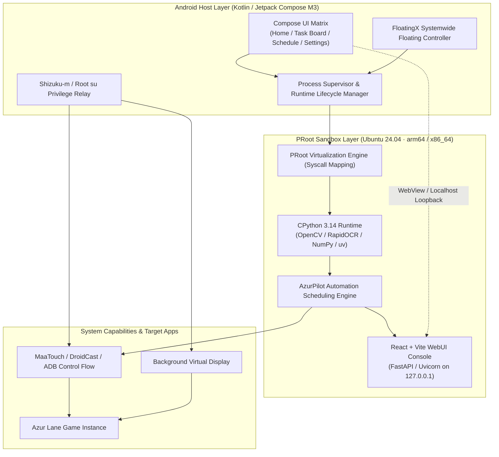

<div align="center">


# AzurPilot for Android

**No PC or Dedicated Server Required · Native Lightweight Execution · Seamless Background Virtual Display Automation**

An all-in-one integrated Android runtime environment tailored for the full-featured *Azur Lane* automation tool [AzurPilot](https://github.com/wess09/AzurPilot)

This repository is forked from [ALAS-AOS](https://github.com/Shinarin/ALAS-AOS), inheriting its host architecture, its PRoot containerization approach, its rootless privilege escalation design, and the AGPL-3.0 license.

<p align="center">
  <a href="README.md">简体中文</a> |
  <b>English</b> |
  <a href="README_ja.md">日本語</a> |
  <a href="README_zh-TW.md">繁體中文</a>
</p>

---

<!-- Core Environment & Platform Badges -->
<p align="center">
  <a href="./LICENSE"></a>
  <a href="https://developer.android.com/about/versions/pie"></a>
  <a href="https://en.wikipedia.org/wiki/AArch64"></a>
  <a href="https://ubuntu.com/"></a>
  <a href="https://www.python.org/"></a>
  <a href="https://github.com/astral-sh/uv"></a>
</p>

<!-- Tech Stack & Framework Badges -->
<p align="center">
  <a href="https://kotlinlang.org/"></a>
  <a href="https://react.dev/"></a>
  <a href="https://github.com/wess09/shizuku-m"></a>
  <a href="https://opencv.org/"></a>
  <a href="https://proot-me.github.io/"></a>
  <a href="https://deepwiki.com/wess09/AzurPilot-for-Android"></a>
</p>

<!-- Repo Metrics Badges -->
<p align="center">
  <a href="https://github.com/wess09/AzurPilot-for-Android/releases/latest"></a>
  <a href="https://github.com/wess09/AzurPilot-for-Android/releases"></a>
  <a href="https://github.com/wess09/AzurPilot-for-Android/stargazers"></a>
  <a href="https://github.com/wess09/AzurPilot-for-Android/network/members"></a>
  <a href="https://github.com/wess09/AzurPilot-for-Android/issues"></a>
  <a href="https://github.com/wess09/AzurPilot-for-Android/commits/main"></a>
</p>

<p align="center">
  <a href="#project-overview--metrics">Overview</a> •
  <a href="#knowledge-base--ai-qa">AI Q&A</a> •
  <a href="#introduction">Introduction</a> •
  <a href="#related-ecosystem-projects">Ecosystem</a> •
  <a href="#key-highlights">Highlights</a> •
  <a href="#system-architecture">Architecture</a> •
  <a href="#specifications--compatibility">Specs</a> •
  <a href="#quick-start">Quick Start</a> •
  <a href="#app-previews">App Previews</a> •
  <a href="#ui-showcase">UI Showcase</a> •
  <a href="#dual-track-independent-updates">Dual-Track Updates</a> •
  <a href="#development-activity">Activity</a> •
  <a href="#star-history">Star History</a> •
  <a href="#community--support">Community</a>
</p>

</div>

---

## Project Overview & Metrics

<table width="100%">
  <thead>
    <tr>
      <th colspan="4" align="left">
        
        <b>Core Operational & Development Metrics</b>
      </th>
    </tr>
  </thead>
  <tbody>
    <tr>
      <td width="25%"><b>Latest Release</b><br><a href="https://github.com/wess09/AzurPilot-for-Android/releases/latest"></a></td>
      <td width="25%"><b>Total Downloads</b><br><a href="https://github.com/wess09/AzurPilot-for-Android/releases"></a></td>
      <td width="25%"><b>Open Source License</b><br><a href="./LICENSE"></a></td>
      <td width="25%"><b>Main Branch Status</b><br><a href="https://github.com/wess09/AzurPilot-for-Android/actions"></a></td>
    </tr>
    <tr>
      <td width="25%"><b>Repository Size</b><br></td>
      <td width="25%"><b>Languages</b><br></td>
      <td width="25%"><b>Privilege Backend</b><br></td>
      <td width="25%"><b>Target System</b><br></td>
    </tr>
    <tr>
      <td colspan="4">
        <b>Quick Links:</b>
        <a href="https://github.com/wess09/AzurPilot-for-Android/releases/latest"></a>
        <a href="https://deepwiki.com/wess09/AzurPilot-for-Android"></a>
        <a href="https://github.com/wess09/AzurPilot-for-Android/issues/new/choose"></a>
        <a href="https://github.com/wess09/AzurPilot-for-Android/pulls"></a>
        <a href="https://github.com/wess09/AzurPilot-for-Android/stargazers"></a>
      </td>
    </tr>
  </tbody>
</table>

---

## Knowledge Base & AI Q&A

<table width="100%">
  <tr>
    <td width="70%" valign="middle">
      <br>
      <h3>Ask DeepWiki Codebase Q&A</h3>
      <p>Have questions about internal modules, PRoot sandboxing, Virtual Display rendering, or task scheduling rules? Ask DeepWiki directly—it is continuously indexed with the complete repository context for targeted architectural breakdown and code guidance.</p>
      <div>
        <a href="https://deepwiki.com/wess09/AzurPilot-for-Android">
          
        </a>
        <a href="https://deepwiki.com/wess09/AzurPilot-for-Android">
          
        </a>
      </div>
    </td>
    <td width="30%" align="center" valign="middle">
      <a href="https://deepwiki.com/wess09/AzurPilot-for-Android">
        <br><br>
        
      </a>
    </td>
  </tr>
</table>

---

<table width="100%">
  <tr>
    <td width="70%" valign="middle">
      <h3>Finding AzurPilot for Android Helpful?</h3>
      <p>Starring this project is the greatest encouragement for the maintainers to keep optimizing and innovating. Click the button on the right to join our stargazers!</p>
      <div>
        <a href="https://github.com/wess09/AzurPilot-for-Android/stargazers"></a>
        <a href="https://github.com/wess09/AzurPilot-for-Android/network/members"></a>
        <a href="https://github.com/wess09/AzurPilot-for-Android/watchers"></a>
      </div>
    </td>
    <td width="30%" align="center" valign="middle">
      <a href="https://github.com/wess09/AzurPilot-for-Android">
        <br><br>
        
      </a>
    </td>
  </tr>
</table>

---

## Introduction

**AzurPilot for Android** is dedicated to bringing the mature, desktop-grade *Azur Lane* automation assistant directly to native Android devices.

By embedding a full Linux runtime container (Ubuntu 24.04, shipped per device architecture as arm64-v8a and x86_64 Runtime variants) inside the APK package, coupled with lightweight PRoot container isolation, it achieves **completely Root-free** and reliable execution of CPython, precompiled OCR models, and local WebUI services. Leveraging background virtual displays and accessibility services, users can chat, play games, or work on their device's main screen without interruption while automated sortie tasks run seamlessly in the background.

---

## Related Ecosystem Projects

This project works closely with its related core projects; key dependencies and source projects are listed below:

<table width="100%">
  <tr>
    <td width="33%" valign="top">
      <div align="center">
        <a href="https://github.com/wess09/AzurPilot-for-Android">
          
        </a>
      </div>
      <br>
      <b>Host Runtime (This Project)</b>
      <p>Integrated Android runtime base: PRoot rootless container, background Virtual Display, global overlay, and lifecycle management.</p>
      <hr>
      <div>
        
        
        
      </div>
    </td>
    <td width="33%" valign="top">
      <div align="center">
        <a href="https://github.com/wess09/AzurPilot">
          
        </a>
      </div>
      <br>
      <b>Core Automation Engine</b>
      <p>The core *Azur Lane* automation tool, featuring computer vision recognition, sortie scheduling algorithms, and a local Web console.</p>
      <hr>
      <div>
        
        
        
      </div>
    </td>
    <td width="33%" valign="top">
      <div align="center">
        <a href="https://github.com/Shinarin/ALAS-AOS">
          
        </a>
      </div>
      <br>
      <b>Source Project (this repo is forked from it)</b>
      <p>A pioneering implementation of Linux runtimes and rootless privilege escalation on mobile Android, from which this repo's host architecture and containerization approach evolved.</p>
      <hr>
      <div>
        
        
        
      </div>
    </td>
  </tr>
</table>

---

## Key Highlights

<table width="100%">
  <tr>
    <td width="50%" valign="top">
      <br>
      <h3>Zero-Config One-Click Deployment</h3>
      <p>The entire runtime environment (Ubuntu Base, Python 3.14, scientific computing and computer vision dependencies, pre-bundled OCR model weights, and WebUI assets) is packaged inside the APK. It unpacks automatically into the private sandbox upon initial launch—no cross-compilation setup or huge online downloads required.</p>
      <div>
        
        
        
      </div>
    </td>
    <td width="50%" valign="top">
      <br>
      <h3>Seamless Background Virtual Display</h3>
      <p>Leveraging Android's Virtual Display mechanism, both the game instance and screen capture operate entirely on an isolated display layer. The foreground main screen remains free for daily apps, chat, or gaming with zero visual obstruction or input interruption.</p>
      <div>
        
        
        
      </div>
    </td>
  </tr>
  <tr>
    <td width="50%" valign="top">
      <br>
      <h3>Multi-Dimensional Floating Overlay</h3>
      <p>Built-in lightweight global floating controller accessible from any app or home screen. Quickly start/pause tasks, monitor scheduling queues, switch instances, and scroll real-time runtime log feeds with a single tap.</p>
      <div>
        
        
        
      </div>
    </td>
    <td width="50%" valign="top">
      <br>
      <h3>Complete Embedded WebUI Experience</h3>
      <p>Directly runs the native React + Vite management interface on device. Offers fine-grained instance configurations, sortie strategy plans, schedule automation rules, and live dashboards without requiring an external desktop browser.</p>
      <div>
        
        
        
      </div>
    </td>
  </tr>
  <tr>
    <td width="50%" valign="top">
      <br>
      <h3>Isolated Logging & Visual Diagnostic History</h3>
      <p>Android host logs and AzurPilot core logs are archived independently. An error snapshot is automatically recorded upon exceptions; includes one-tap diagnostic zip export and a 7-day auto-rotation policy to optimize storage usage.</p>
      <div>
        
        
        
      </div>
    </td>
    <td width="50%" valign="top">
      <br>
      <h3>Dual-Track Independent Hot Updates</h3>
      <p>The host app and the underlying Linux Runtime (rootfs) possess decoupled distribution and upgrade channels. Updating the container preserves all configs and logs; updating the host requires only a lightweight APK without re-unpacking the runtime.</p>
      <div>
        
        
        
      </div>
    </td>
  </tr>
</table>

---

## System Architecture

The project adopts a modular, decoupled layered architecture with clearly demarcated communication boundaries:



---

## Specifications & Compatibility

<table width="100%">
  <thead>
    <tr>
      <th width="18%">Dimension</th>
      <th width="28%">Minimum Requirement</th>
      <th width="28%">Recommended Config</th>
      <th width="26%">Notes</th>
    </tr>
  </thead>
  <tbody>
    <tr>
      <td><b>Operating System</b></td>
      <td></td>
      <td></td>
      <td>Requires modern Android permission isolation and scoped storage</td>
    </tr>
    <tr>
      <td><b>Processor Architecture</b></td>
      <td></td>
      <td></td>
      <td>Relies on 64-bit Linux binaries; 32-bit devices are not supported</td>
    </tr>
    <tr>
      <td><b>Storage Space</b></td>
      <td>=%202.5%20GB-yellow?style=flat-square" alt="2.5GB"></td>
      <td>=%205.0%20GB-brightgreen?style=flat-square" alt="5.0GB"></td>
      <td>Accommodates rootfs, dependencies, models, and diagnostic snapshots</td>
    </tr>
    <tr>
      <td><b>System RAM</b></td>
      <td>=%204%20GB-yellow?style=flat-square" alt="4GB"></td>
      <td>=%206%20GB%2B-brightgreen?style=flat-square" alt="6GB+"></td>
      <td>Ensures stability during concurrent execution of Python algorithms and game</td>
    </tr>
    <tr>
      <td><b>Privilege Backend</b></td>
      <td></td>
      <td></td>
      <td>Required for input simulation and Virtual Display projection authorization; MediaTek devices should use the patched build linked below</td>
    </tr>
  </tbody>
</table>

---

## Quick Start

<table width="100%">
  <tr>
    <td width="25%" valign="top">
      <div align="center">
        <br>
        <h4>Get the APK</h4>
      </div>
      Go to <a href="https://github.com/wess09/AzurPilot-for-Android/releases/latest">Releases</a> and download the <b>Full APK matching your device architecture</b> (arm64-v8a / x86_64; each bundles its pre-built Runtime rootfs image).
    </td>
    <td width="25%" valign="top">
      <div align="center">
        <br>
        <h4>Initial Extraction</h4>
      </div>
      Launch the app after installation and wait for the rootfs to unpack into the sandbox (approx. 1–3 minutes on first boot).
    </td>
    <td width="25%" valign="top">
      <div align="center">
        <br>
        <h4>Grant Permissions</h4>
      </div>
      Authorize via <a href="https://github.com/wess09/shizuku-m/releases/tag/v13.6.0-m2.r1093.bcb2b62a">Shizuku-m</a> according to the prompt, or switch to the Root backend in Settings.
    </td>
    <td width="25%" valign="top">
      <div align="center">
        <br>
        <h4>Configure Automation</h4>
      </div>
      Check video streaming on the "Task Board" page, then enter the embedded "AzurPilot" WebUI to configure your sortie schedule.
    </td>
  </tr>
</table>

> [!TIP]
> **[Shizuku-m](https://github.com/wess09/shizuku-m)** — the patched build maintained by this project — is highly recommended: it operates without wireless debugging, works reliably without external Wi-Fi networks, and fixes the user-service startup failure on MediaTek devices. See the note below.

> [!WARNING]
> **On MediaTek devices use the [patched Shizuku-m build](https://github.com/wess09/shizuku-m/releases/tag/v13.6.0-m2.r1093.bcb2b62a), not the official 13.6.x.** Since 13.6, Shizuku initializes the privileged user-service process with an `Application`, which hits MediaTek's resource-preload hook injected into `LoadedApk.makeApplication` (`procName` is null → NPE) and the process immediately calls `System.exit(1)`. The symptom is that Shizuku is authorized and its binder is reachable, yet the privileged service always times out, and `service_boot_debug.log` is never written under `debug/`. Acknowledged by the official project but still unfixed ([#1198](https://github.com/RikkaApps/Shizuku/issues/1198) / [#1171](https://github.com/RikkaApps/Shizuku/issues/1171)); the patched build falls back to the pre-13.6 Context-only path.

> [!IMPORTANT]
> The **Full APK** bundles Runtime and unpacks it locally on first launch, with no network needed; the **Incremental APK** carries no Runtime and downloads the ~1GB Runtime for your device architecture from GitHub on first launch (Wi-Fi recommended; multi-mirror and multi-threaded segmented download supported, configurable in Settings). For later host-only updates, install the incremental APK over the existing app to reuse the Runtime already on disk.

---

## App Previews

#### 简体中文

| | Home | AzurPilot | Settings | Virtual Display |
|:---:|:---:|:---:|:---:|:---:|
| **Dark** |  |  |  |  |
| **Light** |  |  |  |  |

#### 繁體中文

| | Home | AzurPilot | Settings | Virtual Display |
|:---:|:---:|:---:|:---:|:---:|
| **Dark** |  |  |  |  |
| **Light** |  |  |  |  |

#### English

| | Home | AzurPilot | Settings | Virtual Display |
|:---:|:---:|:---:|:---:|:---:|
| **Dark** |  |  |  |  |
| **Light** |  |  |  |  |

#### 日本語

| | Home | AzurPilot | Settings | Virtual Display |
|:---:|:---:|:---:|:---:|:---:|
| **Dark** |  |  |  |  |
| **Light** |  |  |  |  |

---

## UI Showcase

<table width="100%">
  <thead>
    <tr>
      <th width="15%">Module</th>
      <th width="45%">Core Functionality</th>
      <th width="20%">Interaction</th>
      <th width="20%">Status Tag</th>
    </tr>
  </thead>
  <tbody>
    <tr>
      <td><b>Dashboard</b></td>
      <td>Presents overall system health, PRoot status, CPU/RAM utilization, and quick diagnostic links.</td>
      <td>Card metrics, 1-tap diagnosis</td>
      <td></td>
    </tr>
    <tr>
      <td><b>Task Board</b></td>
      <td>Live preview of background Virtual Display, sortie queue management, and manual touch takeover.</td>
      <td>Low-latency stream, live takeover</td>
      <td></td>
    </tr>
    <tr>
      <td><b>Scheduler</b></td>
      <td>Calendar-based task planning, conditional triggers, automatic wakeup, and offline queuing.</td>
      <td>Flexible rule matching, cyclic loops</td>
      <td></td>
    </tr>
    <tr>
      <td><b>AzurPilot Console</b></td>
      <td>Native in-app console: task configuration, instance management, live logs, statistics dashboards, and Runtime updates — UI generated from the upstream schema.</td>
      <td>Native rendering, no context switch</td>
      <td></td>
    </tr>
    <tr>
      <td><b>Settings</b></td>
      <td>Manage dual-track update channels, runtime quotas, virtual display resolutions, and log exports.</td>
      <td>Persistent preferences, SHA checks</td>
      <td></td>
    </tr>
    <tr>
      <td><b>Floating Overlay</b></td>
      <td>Overlays systemwide over any app, displaying current progress with instant pause/resume and live logs.</td>
      <td>Mini capsule, draggable</td>
      <td></td>
    </tr>
  </tbody>
</table>

---

## Dual-Track Independent Updates

To maximize stability and update flexibility, the host application and Linux runtime are managed via decoupled channels:

<table width="100%">
  <tr>
    <td width="50%" valign="top">
      <div align="center">
        <br>
        <h4>Lightweight Host Overwrite</h4>
      </div>
      <ul>
        <li><b>Trigger</b>: Monitored via Android internal <code>VersionCode</code>.</li>
        <li><b>Payload</b>: Lightweight APK containing only native Android code.</li>
        <li><b>Process</b>: Standard system <code>PackageInstaller</code> in-place upgrade.</li>
        <li><b>Data Safety</b>: Completely preserves existing Linux rootfs, user configurations, and logs.</li>
      </ul>
    </td>
    <td width="50%" valign="top">
      <div align="center">
        <br>
        <h4>Decoupled Container Hot Replacement</h4>
      </div>
      <ul>
        <li><b>Trigger</b>: Checked against <code>latest.json</code> signature in GitHub Releases.</li>
        <li><b>Verification</b>: Strict SHA-256 hash and byte length check after download.</li>
        <li><b>Mechanism</b>: Gracefully stops Python services, swaps container rootfs, and preserves <code>/config</code> and data mounts.</li>
        <li><b>Fallback</b>: Continues running current version smoothly if network fails or user postpones.</li>
      </ul>
    </td>
  </tr>
</table>

---

## Development Activity

<table width="100%">
  <thead>
    <tr>
      <th colspan="3" align="left">
        
        <b>Repository Velocity & Responsiveness</b>
      </th>
    </tr>
  </thead>
  <tbody>
    <tr>
      <td width="33%">
        <b>Commit Frequency</b><br>
        <br>
        <small>Monthly commit activity</small>
      </td>
      <td width="33%">
        <b>Pull Requests Closed</b><br>
        <br>
        <small>Total merged/closed PRs</small>
      </td>
      <td width="33%">
        <b>Issues Resolved</b><br>
        <br>
        <small>Successfully closed issues</small>
      </td>
    </tr>
    <tr>
      <td width="33%">
        <b>Active Branch</b><br>
        <br>
        <small>Continuous delivery trunk</small>
      </td>
      <td width="33%">
        <b>Automated CI/CD</b><br>
        <br>
        <small>Native runner matrix verification</small>
      </td>
      <td width="33%">
        <b>Latest Commit</b><br>
        <a href="https://github.com/wess09/AzurPilot-for-Android/commits/main"></a><br>
        <small>Track newest code evolution</small>
      </td>
    </tr>
  </tbody>
</table>

---

## Star History

Adaptive dark/light mode Star History chart reflecting project growth:

<div align="center">
  <picture>
    <source media="(prefers-color-scheme: dark)" srcset="https://api.star-history.com/svg?repos=wess09/AzurPilot-for-Android&type=Date&theme=dark" />
    <source media="(prefers-color-scheme: light)" srcset="https://api.star-history.com/svg?repos=wess09/AzurPilot-for-Android&type=Date" />
    
  </picture>
  <br>
  <sub>Real-time data powered by <a href="https://star-history.com/#wess09/AzurPilot-for-Android&Date">Star-History</a> · Click to explore interactive graph</sub>
</div>

---

## Project Directory & Architecture

```
.
|-- app/                      # Android Host project source (Kotlin + Jetpack Compose)
|   |-- app/                  # Core application module, Compose UI, and state flow
|   |-- annotation-api/       # Annotation definitions and interface contracts
|   |-- ksp-processor/        # Compile-time KSP code generation processor
|   `-- gradle/               # Version catalog (libs.versions.toml)
|-- rootfs/                   # Linux runtime packaging scripts & dependency definitions
|   `-- build/                # build-azurpilot.sh rootfs slimming and bundling script
|-- .github/workflows/        # CI/CD pipeline automation (rootfs.yml)
`-- tools/                    # Build tooling and local debugging scripts
```

- **Build Tooling Standards**: Android Gradle Plugin 8.x, Kotlin 2.x, Jetpack Compose Material 3.
- **Automated Pipeline**: a matrix of native GitHub Actions runners (arm64 / x86_64) executes Ubuntu 24.04 slimming, uv dependency pre-installation, WebUI packaging, and high-ratio xz compression, publishing one artifact per architecture.
- **Release Security**: Production signing keys are secured via GitHub Actions Secrets to prevent tampering.

---

## Tech Stack & Dependency Acknowledgments

### Core Runtime & System Foundation

| Component | License Badge | Role |
| :--- | :--- | :--- |
| **Ubuntu Base 24.04** |  | Per-architecture Linux container base (arm64 / amd64) |
| **PRoot** |  | Rootless userspace syscall emulation engine |
| **uv** |  | High-performance modern Python package manager |
| **CPython 3.14** |  | Core Python execution runtime |
| **AzurPilot** |  | Core automation logic and task engine |
| **ALAS-AOS** |  | Source repository of this project; this repo is forked from it and inherits its host architecture and containerization approach |
| **MaaFwApp** |  | Android host architecture and app framework template |

### Android Host Stack

| Library | License Badge | Usage |
| :--- | :--- | :--- |
| **AndroidX Suite** |  | Modern components: Jetpack Compose, Lifecycle, DataStore |
| **Koin** |  | Pragmatic lightweight dependency injection |
| **OkHttp** |  | High-performance HTTP client |
| **Shizuku API** |  | Rootless inter-process privilege and IPC interface |
| **libsu** |  | Robust Shell execution framework under Root mode |
| **FloatingX** |  | Versatile Android systemwide floating window framework |
| **XXPermissions** |  | Runtime permission handling and state tracking |
| **Apache Commons Compress** |  | Archive stream extraction and file processing |
| **XZ for Java** |  | High-compression ratio rootfs archive decompression |

---

## Community & Support

<table width="100%">
  <tr>
    <td width="50%" valign="top">
      <div align="center">
        <a href="https://github.com/wess09/AzurPilot-for-Android/graphs/contributors">
          
        </a>
        <br><br>
        <h4>Open Source Collaboration</h4>
        <p>Warm thanks to all developers contributing code, architecture reviews, debugging, and testing. Pull requests and feedback are always welcome!</p>
        <a href="https://github.com/wess09/AzurPilot-for-Android/graphs/contributors">
          
        </a>
        <a href="https://github.com/wess09/AzurPilot-for-Android/issues/new/choose">
          
        </a>
      </div>
    </td>
    <td width="50%" valign="top">
      <div align="center">
        <a href="https://github.com/wess09/AzurPilot-for-Android/stargazers">
          
        </a>
        <br><br>
        <h4>Project Support</h4>
        <p>If AzurPilot for Android enhances your daily gameplay experience, consider starring the repo to support its continuous development.</p>
        <a href="https://star-history.com/#wess09/AzurPilot-for-Android&Date">
          
        </a>
      </div>
    </td>
  </tr>
</table>

---

## License Notice

This project is licensed under the [GNU Affero General Public License v3.0 (AGPL-3.0)](LICENSE).

Bundled component licenses included in this repository:
- [`LICENSE-ALAS-AOS`](LICENSE-ALAS-AOS) — AGPL-3.0
- [`LICENSE-MaaFwApp`](LICENSE-MaaFwApp) — AGPL-3.0
- [`LICENSE-AzurPilot`](LICENSE-AzurPilot) — GPL-3.0

Original license texts for all Python dependencies and transitive packages (152 total) are archived on-device at `/opt/azurpilot/licenses`.

---

<div align="center">
  <sub>AzurPilot for Android is open-source and community-maintained. For issues or feature requests, feel free to open an Issue or Pull Request.</sub>
</div>
