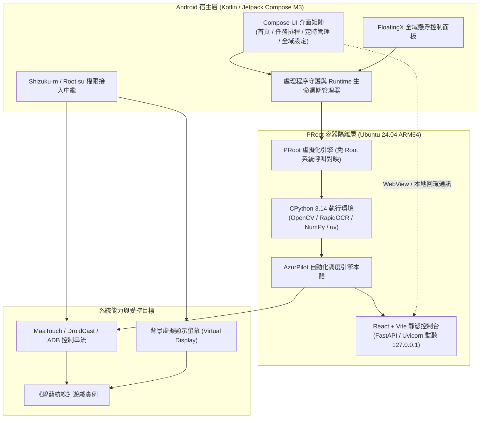

<div align="center">


# AzurPilot for Android

**無需電腦與常駐伺服器 · 原生輕量化運作 · 背景虛擬螢幕無感掛機**

全功能《碧藍航線》自動化助手 [AzurPilot](https://github.com/wess09/AzurPilot) 專用的 Android 行動端一體化執行環境

<p align="center">
  <a href="README.md">简体中文</a> |
  <a href="README_en.md">English</a> |
  <a href="README_ja.md">日本語</a> |
  <b>繁體中文</b>
</p>

---

<!-- 核心環境與平台標籤組 -->
<p align="center">
  <a href="./LICENSE"></a>
  <a href="https://developer.android.com/about/versions/pie"></a>
  <a href="https://en.wikipedia.org/wiki/AArch64"></a>
  <a href="https://ubuntu.com/"></a>
  <a href="https://www.python.org/"></a>
  <a href="https://github.com/astral-sh/uv"></a>
</p>

<!-- 技術棧與框架標籤組 -->
<p align="center">
  <a href="https://kotlinlang.org/"></a>
  <a href="https://react.dev/"></a>
  <a href="https://shizuku.rikka.app/"></a>
  <a href="https://opencv.org/"></a>
  <a href="https://proot-me.github.io/"></a>
  <a href="https://deepwiki.com/wess09/AzurPilot-for-Android"></a>
</p>

<!-- 倉庫動態與社群指標標籤組 -->
<p align="center">
  <a href="https://github.com/wess09/AzurPilot-for-Android/releases/latest"></a>
  <a href="https://github.com/wess09/AzurPilot-for-Android/releases"></a>
  <a href="https://github.com/wess09/AzurPilot-for-Android/stargazers"></a>
  <a href="https://github.com/wess09/AzurPilot-for-Android/network/members"></a>
  <a href="https://github.com/wess09/AzurPilot-for-Android/issues"></a>
  <a href="https://github.com/wess09/AzurPilot-for-Android/commits/main"></a>
</p>

<p align="center">
  <a href="#專案總覽與指標">專案總覽</a> •
  <a href="#程式碼知識庫與-ai-問答">智慧問答</a> •
  <a href="#專案概述">專案概述</a> •
  <a href="#關聯生態專案">關聯生態</a> •
  <a href="#核心特色">核心特色</a> •
  <a href="#系統架構全景">系統架構</a> •
  <a href="#環境規格與相容性">環境規格</a> •
  <a href="#快速開始">快速開始</a> •
  <a href="#功能介面一覽">功能介面</a> •
  <a href="#雙軌獨立更新機制">雙軌更新</a> •
  <a href="#研發活躍度">研發活躍</a> •
  <a href="#star-成長趨勢">成長趨勢</a> •
  <a href="#社群生態與支援">社群支援</a>
</p>

</div>

---

## 專案總覽與指標

<table width="100%">
  <thead>
    <tr>
      <th colspan="4" align="left">
        
        <b>專案核心執行與研發指標</b>
      </th>
    </tr>
  </thead>
  <tbody>
    <tr>
      <td width="25%"><b>最新正式版</b><br><a href="https://github.com/wess09/AzurPilot-for-Android/releases/latest"></a></td>
      <td width="25%"><b>累計下載量</b><br><a href="https://github.com/wess09/AzurPilot-for-Android/releases"></a></td>
      <td width="25%"><b>開源授權</b><br><a href="./LICENSE"></a></td>
      <td width="25%"><b>主分支狀態</b><br><a href="https://github.com/wess09/AzurPilot-for-Android/actions"></a></td>
    </tr>
    <tr>
      <td width="25%"><b>程式碼庫容量</b><br></td>
      <td width="25%"><b>主要語言</b><br></td>
      <td width="25%"><b>提權執行方式</b><br></td>
      <td width="25%"><b>目標系統</b><br></td>
    </tr>
    <tr>
      <td colspan="4">
        <b>快速操作捷徑：</b>
        <a href="https://github.com/wess09/AzurPilot-for-Android/releases/latest"></a>
        <a href="https://deepwiki.com/wess09/AzurPilot-for-Android"></a>
        <a href="https://github.com/wess09/AzurPilot-for-Android/issues/new/choose"></a>
        <a href="https://github.com/wess09/AzurPilot-for-Android/pulls"></a>
        <a href="https://github.com/wess09/AzurPilot-for-Android/stargazers"></a>
      </td>
    </tr>
  </tbody>
</table>

---

## 程式碼知識庫與 AI 問答

<table width="100%">
  <tr>
    <td width="70%" valign="middle">
      <br>
      <h3>Ask DeepWiki 程式碼庫智慧問答</h3>
      <p>對專案的內部模組、PRoot 沙盒機制、虛擬螢幕渲染邏輯或排程排定規則有任何疑問？直接向已索引本倉庫全量上下文的 DeepWiki 發起提問，快速獲取具針對性的架構解析與程式碼指引。</p>
      <div>
        <a href="https://deepwiki.com/wess09/AzurPilot-for-Android">
          
        </a>
        <a href="https://deepwiki.com/wess09/AzurPilot-for-Android">
          
        </a>
      </div>
    </td>
    <td width="30%" align="center" valign="middle">
      <a href="https://deepwiki.com/wess09/AzurPilot-for-Android">
        <br><br>
        
      </a>
    </td>
  </tr>
</table>

---

<table width="100%">
  <tr>
    <td width="70%" valign="middle">
      <h3>如果 AzurPilot for Android 為你帶來了便利</h3>
      <p>給專案點亮一顆 Star 是對維護者持續更新與技術攻關最大的肯定。只需點選右側按鈕即可加入關注者列表！</p>
      <div>
        <a href="https://github.com/wess09/AzurPilot-for-Android/stargazers"></a>
        <a href="https://github.com/wess09/AzurPilot-for-Android/network/members"></a>
        <a href="https://github.com/wess09/AzurPilot-for-Android/watchers"></a>
      </div>
    </td>
    <td width="30%" align="center" valign="middle">
      <a href="https://github.com/wess09/AzurPilot-for-Android">
        <br><br>
        
      </a>
    </td>
  </tr>
</table>

---

## 專案概述

**AzurPilot for Android** 致力於將桌面端功能成熟的《碧藍航線》自動化助手完整移植至 Android 行動端原生執行。

透過在 APK 安裝包內預置完整的 Linux 執行階段容器（Ubuntu 24.04 ARM64），結合輕量級 PRoot 容器隔離技術，實現了在 **完全免 Root** 條件下穩定執行 CPython、預編譯 OCR 演算法模型及本地 Web 控制台服務。借助背景虛擬螢幕與無障礙互動服務，使用者可以在手機主螢幕正常聊天、遊戲或辦公的同時，無感完成各項自動化巡航與出擊任務。

---

## 關聯生態專案

本專案與上下游核心專案緊密連動，關鍵相依與源流專案如下：

<table width="100%">
  <tr>
    <td width="33%" valign="top">
      <div align="center">
        <a href="https://github.com/wess09/AzurPilot-for-Android">
          
        </a>
      </div>
      <br>
      <b>宿主執行環境 (當前專案)</b>
      <p>面向 Android 行動端的一體化執行基座，打通 PRoot 免 Root 容器、背景虛擬螢幕、全域懸浮視窗與生命週期管理。</p>
      <hr>
      <div>
        
        
        
      </div>
    </td>
    <td width="33%" valign="top">
      <div align="center">
        <a href="https://github.com/wess09/AzurPilot">
          
        </a>
      </div>
      <br>
      <b>核心自動化引擎本體</b>
      <p>《碧藍航線》自動化助手核心，包含完備的電腦視覺影像辨識、出擊排程演算法與本地 Web 控制台服務。</p>
      <hr>
      <div>
        
        
        
      </div>
    </td>
    <td width="33%" valign="top">
      <div align="center">
        <a href="https://github.com/Shinarin/ALAS-AOS">
          
        </a>
      </div>
      <br>
      <b>容器化方案源流</b>
      <p>行動端 Linux 執行環境方案與免 Root 提權思維的基石專案，為 Android 自動化部署提供核心技術路線參考。</p>
      <hr>
      <div>
        
        
        
      </div>
    </td>
  </tr>
</table>

---

## 核心特色

<table width="100%">
  <tr>
    <td width="50%" valign="top">
      <br>
      <h3>零配置一鍵部署</h3>
      <p>完整執行環境（Ubuntu Base、Python 3.14、科學計算與電腦視覺依賴、預置 OCR 模型權重及前端資源）全內建於安裝包中。安裝後自動釋放至私有沙盒，無需配置交叉編譯環境或線上大量下載額外執行包。</p>
      <div>
        
        
        
      </div>
    </td>
    <td width="50%" valign="top">
      <br>
      <h3>背景虛擬螢幕無感掛機</h3>
      <p>基於 Android 虛擬螢幕（Virtual Display）機制，遊戲執行個體與影像擷取完全在獨立的虛擬顯示層運作。主螢幕操作與日常應用互不干擾，徹底告別實體螢幕被佔用或操作被打斷的困擾。</p>
      <div>
        
        
        
      </div>
    </td>
  </tr>
  <tr>
    <td width="50%" valign="top">
      <br>
      <h3>多維懸浮視窗互動面板</h3>
      <p>內建輕量級全域浮窗控制器，在任何第三方 App 或桌面層級均可一鍵喚起。支援快速啟動/暫停任務、檢查排程佇列、切換目標實例並即時捲動瀏覽執行階段日誌輸出。</p>
      <div>
        
        
        
      </div>
    </td>
    <td width="50%" valign="top">
      <br>
      <h3>完整內建 WebUI 體驗</h3>
      <p>手機端直接承載原生 React + Vite 控制台前端，提供完整的實例細項設定、出擊模式編排、定時排程規則與即時數據儀表板，無需額外透過電腦瀏覽器存取。</p>
      <div>
        
        
        
      </div>
    </td>
  </tr>
  <tr>
    <td width="50%" valign="top">
      <br>
      <h3>獨立式日誌與診斷回溯</h3>
      <p>Android 宿主日誌與 AzurPilot 業務日誌雙通道獨立封存。發生異常時自動擷取並持久化當前畫面快照；內建一鍵封裝匯出功能與 7 天自動輪替清除機制，兼顧排障與儲存空間控制。</p>
      <div>
        
        
        
      </div>
    </td>
    <td width="50%" valign="top">
      <br>
      <h3>雙軌獨立熱更新體系</h3>
      <p>宿主 App 與底層 Linux Runtime（rootfs）具備完全解耦的分發與升級機制。更新底層環境不破壞使用者配置與歷史日誌；更新應用程式本體僅需輕量增量包，重複使用既有 Runtime。</p>
      <div>
        
        
        
      </div>
    </td>
  </tr>
</table>

---

## 系統架構全景

專案採用清晰的分層解耦設計，各層級職責明確、通訊邊界規範：



---

## 環境規格與相容性

<table width="100%">
  <thead>
    <tr>
      <th width="18%">維度</th>
      <th width="28%">基本規格指標</th>
      <th width="28%">建議配置</th>
      <th width="26%">說明</th>
    </tr>
  </thead>
  <tbody>
    <tr>
      <td><b>作業系統</b></td>
      <td></td>
      <td></td>
      <td>需符合現代 Android 權限隔離與沙盒儲存機制</td>
    </tr>
    <tr>
      <td><b>處理器架構</b></td>
      <td></td>
      <td></td>
      <td>依賴 64 位元 Linux 二進位檔，不支援 32 位元設備</td>
    </tr>
    <tr>
      <td><b>本機儲存空間</b></td>
      <td>=%202.5%20GB-yellow?style=flat-square" alt="2.5GB"></td>
      <td>=%205.0%20GB-brightgreen?style=flat-square" alt="5.0GB"></td>
      <td>容納完整 Ubuntu 根檔案系統、依賴套件及診斷快照</td>
    </tr>
    <tr>
      <td><b>系統執行記憶體</b></td>
      <td>=%204%20GB-yellow?style=flat-square" alt="4GB"></td>
      <td>=%206%20GB%20或以上-brightgreen?style=flat-square" alt="6GB+"></td>
      <td>確保 Python 演算法處理程序與遊戲多工並行時之穩定性</td>
    </tr>
    <tr>
      <td><b>權限支援</b></td>
      <td></td>
      <td></td>
      <td>用於系統層級觸控模擬與虛擬螢幕投影授權</td>
    </tr>
  </tbody>
</table>

---

## 快速開始

<table width="100%">
  <tr>
    <td width="25%" valign="top">
      <div align="center">
        <br>
        <h4>取得安裝包</h4>
      </div>
      前往 <a href="https://github.com/wess09/AzurPilot-for-Android/releases/latest">Releases 最新版本</a> 下載<b>完整版 APK</b>（安裝包包含預置 Runtime 映像檔）。
    </td>
    <td width="25%" valign="top">
      <div align="center">
        <br>
        <h4>初始化解壓縮</h4>
      </div>
      安裝完成後啟動應用程式，等待底層 Linux 根檔案系統自動釋放至沙盒，初次解壓需要 1 至 3 分鐘。
    </td>
    <td width="25%" valign="top">
      <div align="center">
        <br>
        <h4>接入提權服務</h4>
      </div>
      依照介面指示連接 <a href="https://github.com/Shinarin/shizuku-m">Shizuku-m</a> 授權，或在設定頁面直接切換為 Root 執行後端。
    </td>
    <td width="25%" valign="top">
      <div align="center">
        <br>
        <h4>配置巡航任務</h4>
      </div>
      在「任務」頁面確認畫面串流，進入內嵌「AzurPilot」WebUI 頁面自訂專屬自動化出擊規則。
    </td>
  </tr>
</table>

> [!TIP]
> 推薦使用 **Shizuku-m**，該分支支援免開啟無線偵錯模式、無外部 WLAN 網路環境下亦能正常啟動，大幅提升行動情境下的穩定性。

> [!IMPORTANT]
> **完整版 APK** 內建 Runtime，首次啟動直接在本機解壓縮，無需連網；**輕量增量 APK** 不含 Runtime，首次啟動會自動從 GitHub 下載約 1GB 的 Runtime（建議在 Wi-Fi 環境下進行）。後續若僅有 Android 宿主程式碼更新，下載輕量增量 APK 直接覆蓋安裝即可，無需重新解壓 Runtime。

---

## 功能介面一覽

<table width="100%">
  <thead>
    <tr>
      <th width="15%">介面模組</th>
      <th width="45%">核心職責與承載能力</th>
      <th width="20%">互動特色</th>
      <th width="20%">狀態標誌</th>
    </tr>
  </thead>
  <tbody>
    <tr>
      <td><b>首頁儀表板</b></td>
      <td>呈現系統健康概況、PRoot 容器狀態、CPU/記憶體負載、執行診斷日誌捷徑。</td>
      <td>卡片式看板、一鍵診斷</td>
      <td></td>
    </tr>
    <tr>
      <td><b>任務管理</b></td>
      <td>即時預覽背景虛擬螢幕遊戲畫面、作業佇列排程安排、全螢幕手動觸控接管模式。</td>
      <td>低延遲串流、即時手動介入</td>
      <td></td>
    </tr>
    <tr>
      <td><b>定時管理</b></td>
      <td>編排計畫任務行事曆、定時觸發執行條件、到點自動喚醒與離線佇列管理。</td>
      <td>規則彈性匹配、週期循環</td>
      <td></td>
    </tr>
    <tr>
      <td><b>AzurPilot WebUI</b></td>
      <td>完整呈現 React 控制台前端，細化出擊關卡、編隊策略、委託與資源收集、建造管理。</td>
      <td>內嵌無縫 WebView 直連</td>
      <td></td>
    </tr>
    <tr>
      <td><b>系統設定</b></td>
      <td>管理雙軌更新通道、執行階段配額、虛擬螢幕解析度參數、日誌封存與匯出中心。</td>
      <td>偏好持久化、安全校驗</td>
      <td></td>
    </tr>
    <tr>
      <td><b>全域懸浮視窗</b></td>
      <td>穿透顯示於任何 App 之上，即時呈現排程進度、提供即時暫停/啟動與最新日誌速覽。</td>
      <td>最小化膠囊、拖曳自適應</td>
      <td></td>
    </tr>
  </tbody>
</table>

---

## 雙軌獨立更新機制

為確保環境的極致穩定與升級彈性，系統採用宿主層與執行階段解耦的雙軌管理策略：

<table width="100%">
  <tr>
    <td width="50%" valign="top">
      <div align="center">
        <br>
        <h4>輕量級宿主覆蓋更新</h4>
      </div>
      <ul>
        <li><b>觸發依據</b>：比對 Android 內部版本號（<code>VersionCode</code>）。</li>
        <li><b>升級酬載</b>：僅包含 Android 原生業務層的輕量 APK。</li>
        <li><b>更新過程</b>：呼叫系統標準 <code>PackageInstaller</code> 進行覆蓋安裝。</li>
        <li><b>資料保障</b>：完全重複使用手機已解壓的 Linux Runtime 與全部既有設定檔。</li>
      </ul>
    </td>
    <td width="50%" valign="top">
      <div align="center">
        <br>
        <h4>解耦式容器映像檔熱替換</h4>
      </div>
      <ul>
        <li><b>觸發依據</b>：讀取 GitHub Latest release 中的 <code>latest.json</code> 簽名。</li>
        <li><b>完整性驗證</b>：下載後執行嚴格的 SHA-256 雜湊對比與檔案大小校驗。</li>
        <li><b>熱替換機制</b>：安全停止 Python 服務後替換容器根目錄，保留 <code>/config</code> 及資料磁碟區。</li>
        <li><b>容錯回退</b>：網路異常或使用者選擇稍後時，無縫繼續沿用目前穩定版本。</li>
      </ul>
    </td>
  </tr>
</table>

---

## 研發活躍度

<table width="100%">
  <thead>
    <tr>
      <th colspan="3" align="left">
        
        <b>倉庫研發活躍度與回應態勢</b>
      </th>
    </tr>
  </thead>
  <tbody>
    <tr>
      <td width="33%">
        <b>程式碼提交頻率</b><br>
        <br>
        <small>月度提交活躍狀態</small>
      </td>
      <td width="33%">
        <b>合併請求處理</b><br>
        <br>
        <small>已歸檔合併請求總計</small>
      </td>
      <td width="33%">
        <b>問題回饋解決</b><br>
        <br>
        <small>已成功解決 Issue 統計</small>
      </td>
    </tr>
    <tr>
      <td width="33%">
        <b>研發分支</b><br>
        <br>
        <small>主幹持續交付串流</small>
      </td>
      <td width="33%">
        <b>自動化建置 (CI/CD)</b><br>
        <br>
        <small>ARM64 Runner 持續驗證</small>
      </td>
      <td width="33%">
        <b>最新提交紀錄</b><br>
        <a href="https://github.com/wess09/AzurPilot-for-Android/commits/main"></a><br>
        <small>追蹤最新程式碼演進</small>
      </td>
    </tr>
  </tbody>
</table>

---

## Star 成長趨勢

採用自適應深淺模式的 Star-History 向量歷史圖譜，直觀反映專案發展脈絡：

<div align="center">
  <picture>
    <source media="(prefers-color-scheme: dark)" srcset="https://api.star-history.com/svg?repos=wess09/AzurPilot-for-Android&type=Date&theme=dark" />
    <source media="(prefers-color-scheme: light)" srcset="https://api.star-history.com/svg?repos=wess09/AzurPilot-for-Android&type=Date" />
    
  </picture>
  <br>
  <sub>資料來源基於 <a href="https://star-history.com/#wess09/AzurPilot-for-Android&Date">Star-History</a> 即時更新 · 點選可檢視互動式完整走勢</sub>
</div>

---

## 專案建置全景

```
.
|-- app/                      # Android 宿主專案原始碼 (Kotlin + Jetpack Compose)
|   |-- app/                  # 核心應用模組、Compose UI 實作與狀態串流
|   |-- annotation-api/       # 註解與介面約定模組
|   |-- ksp-processor/        # 編譯期 KSP 程式碼生成處理器
|   `-- gradle/               # 統一依賴版本目錄 (libs.versions.toml)
|-- rootfs/                   # Linux 執行環境打包指令稿與相依套件定義
|   `-- build/                # build-azurpilot.sh 映像檔裁剪與整合指令稿
|-- .github/workflows/        # CI/CD 自動化工作流程 (rootfs.yml)
`-- tools/                    # 建置輔助工具與本機除錯指令稿
```

- **編譯環境規範**：Android Gradle Plugin 8.x、Kotlin 2.x、Jetpack Compose Material 3。
- **自動化建置串流**：基於 GitHub Actions ARM64 Runner 執行 Ubuntu 24.04 映像檔裁剪、uv 相依預先安裝、前端打包與 xz 高壓縮封存。
- **發布簽名安全**：正式簽名金鑰妥善保管於 GitHub Actions Secrets 中，杜絕簽名外洩與未經授權之竄改。

---

## 技術棧與相依致謝

### 核心執行環境與系統基底

| 依賴組件 | 授權識別標籤 | 職責定位 |
| :--- | :--- | :--- |
| **Ubuntu Base 24.04** |  | ARM64 Linux 容器基礎映像檔 |
| **PRoot** |  | 免 Root 使用者空間系統呼叫仿真引擎 |
| **uv** |  | 現代高效能 Python 套件管理工具 |
| **CPython 3.14** |  | 核心直譯器執行環境 |
| **AzurPilot** |  | 核心自動化決策邏輯與任務排程引擎 |
| **ALAS-AOS** |  | Android 容器化執行路線的重要起點與參考基線 |
| **MaaFwApp** |  | Android 宿主架構與工程框架模板 |

### Android 宿主技術棧

| 相依套件庫 | 授權識別標籤 | 用途說明 |
| :--- | :--- | :--- |
| **AndroidX Suite** |  | Jetpack Compose、Lifecycle、DataStore 等現代化組件 |
| **Koin** |  | 輕量實用的依賴注入 (DI) 框架 |
| **OkHttp** |  | 穩定高效的 HTTP 網路通訊用戶端 |
| **Shizuku API** |  | 免 Root 行程間授權與通訊介面 |
| **libsu** |  | Root 模式下穩健的 Shell 提權呼叫框架 |
| **FloatingX** |  | 優雅易用的 Android 全域懸浮視窗框架 |
| **XXPermissions** |  | 動態權限申請與狀態管理方案 |
| **Apache Commons Compress** |  | 執行階段歸檔解壓縮與檔案串流處理 |
| **XZ for Java** |  | 高壓縮比 rootfs 歸檔格式解析支援 |

---

## 社群生態與支援

<table width="100%">
  <tr>
    <td width="50%" valign="top">
      <div align="center">
        <a href="https://github.com/wess09/AzurPilot-for-Android/graphs/contributors">
          
        </a>
        <br><br>
        <h4>開源共建與參與</h4>
        <p>感謝所有參與程式碼提交、架構改進、問題排查與功能驗證的開發者。歡迎隨時提交 Issue 與 PR 參與共建！</p>
        <a href="https://github.com/wess09/AzurPilot-for-Android/graphs/contributors">
          
        </a>
        <a href="https://github.com/wess09/AzurPilot-for-Android/issues/new/choose">
          
        </a>
      </div>
    </td>
    <td width="50%" valign="top">
      <div align="center">
        <a href="https://github.com/wess09/AzurPilot-for-Android/stargazers">
          
        </a>
        <br><br>
        <h4>專案成長與支援</h4>
        <p>如果 AzurPilot for Android 為你的遊戲掛機體驗提供了便利，歡迎前往倉庫首頁點亮 Star 支援專案演進。</p>
        <a href="https://star-history.com/#wess09/AzurPilot-for-Android&Date">
          
        </a>
      </div>
    </td>
  </tr>
</table>

---

## 授權條款說明

本專案採用 [GNU Affero General Public License v3.0 (AGPL-3.0)](LICENSE) 條款開源。

隨專案一同分發的授權條款檔案：
- [`LICENSE-ALAS-AOS`](LICENSE-ALAS-AOS) — AGPL-3.0
- [`LICENSE-MaaFwApp`](LICENSE-MaaFwApp) — AGPL-3.0
- [`LICENSE-AzurPilot`](LICENSE-AzurPilot) — GPL-3.0

各 Python 相依套件及傳遞相依的原授權文本（共 152 項），均已隨執行階段映像檔封存於設備端 `/opt/azurpilot/licenses`。

---

<div align="center">
  <sub>AzurPilot for Android 遵守開源協議並由社群驅動維護。如遇問題歡迎提交 Issue 或 Pull Request。</sub>
</div>
